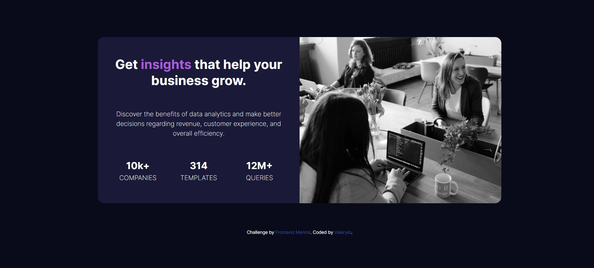
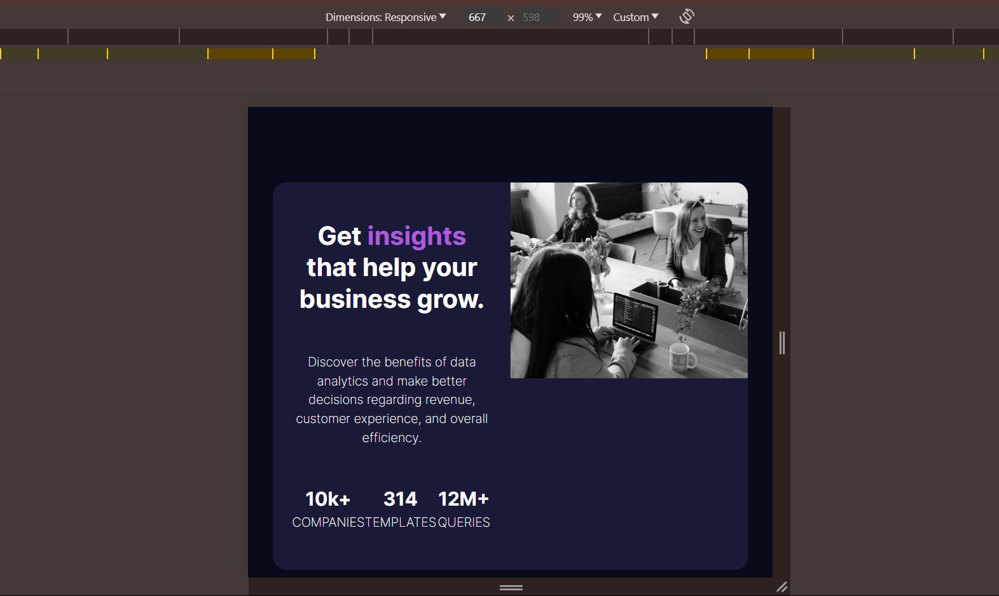
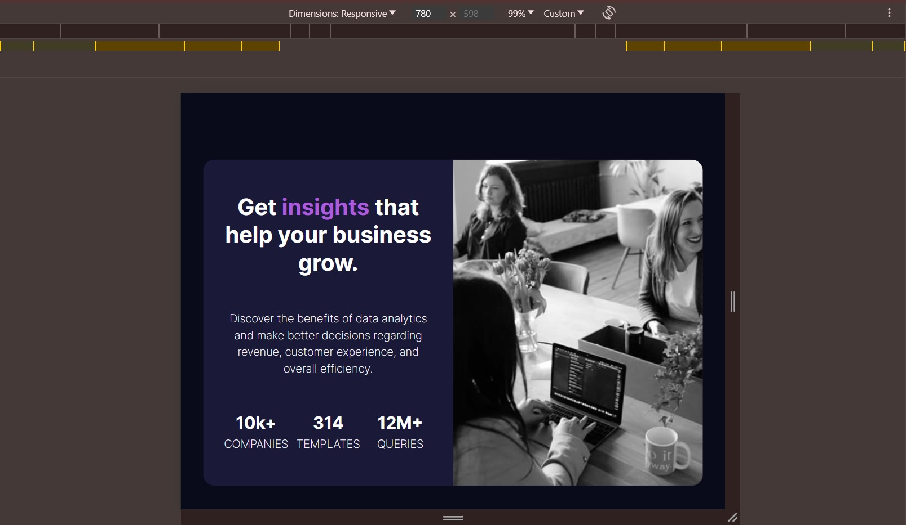

# Frontend Mentor - Stats preview card component solution


## Table of contents

- [Overview](#overview)
  - [The challenge](#the-challenge)
  - [Screenshot](#screenshot)
  - [Links](#links)
  - [What I learned](#what-i-learned)
  - [Useful resources](#useful-resources)
- [Author](#author)

**Note: Delete this note and update the table of contents based on what sections you keep.**

## Overview

### The challenge

Users should be able to:

- View the optimal layout depending on their device's screen size

### Screenshot




### Built with

- Semantic HTML5 markup
- CSS custom properties
- Flexbox
- CSS Grid
- Mobile-first workflow


### What I learned

The most important learning. How to keep an image responsive, but get
a nice overview, when the browser width is getting bigger.

From this



```css
.card__img {
      height: 100%;

      object-fit: cover;
      object-position: center;
}
```

To this...



### Useful resources

- [moderncss.dev/css-only-full-width-responsive-images-2-ways](https://moderncss.dev/css-only-full-width-responsive-images-2-ways/) - This helped me for learning about images styling with the tag img.

## Author

- Frontend Mentor - [@Valeryio](https://www.frontendmentor.io/profile/Valeryio)
- Twitter - [@DOUMfifa56826](https://twitter.com/DoumFifa56826)
